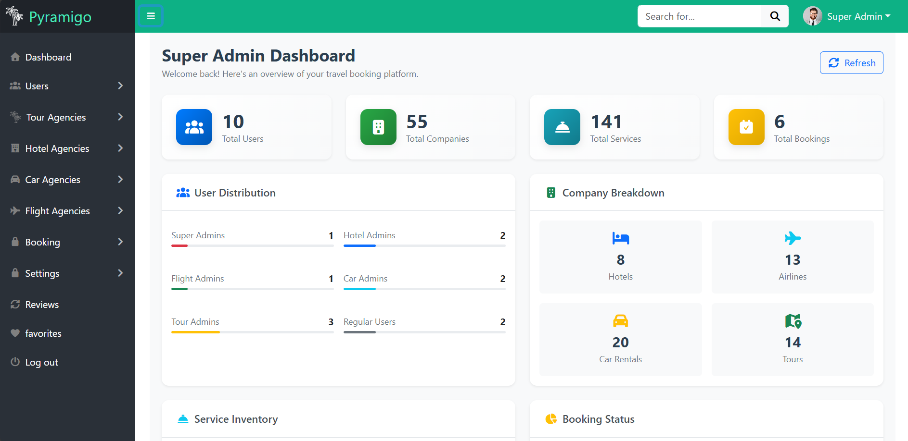

# 🏝️ TravelBooking Angular Project


A modern Admin Dashboard built with Angular for managing the TravelBooking platform.
It provides agencies and admins with tools to manage tours, hotels, flights, cars, bookings, and payments through a clean and powerful interface.

---

## 📗 Table of Contents
- [📖 About the Project](#-about-the-project)
  - [Tech Stack](#tech-stack)
- [💻 Getting Started](#-getting-started)
  - [Prerequisites](#prerequisites)
  - [Setup](#setup)
  - [Install](#install)
  - [Usage](#usage)
  - [Deployment](#deployment)
- [👥 Authors](#-authors)
- [🔭 Future Features](#-future-features)
- [⭐️ Show your support](#-show-your-support)
- [🙏 Acknowledgements](#-acknowledgements)
- [❓ FAQ](#-faq)
- [📝 License](#-license)

---

## 📖 About the Project

The Travel-Booking Admin Dashboard is the control center of the TravelBooking ecosystem.
It includes role-based dashboards for different types of admins:

## 👤 Admin Roles

- SuperAdmin → Full system access (manages everything).
- TourAdmin → Manage tours &tour companies (CRUD).
- HotelAdmin → Manage hotels & rooms (CRUD).
- FlightAdmin → Manage flights & flight companies (CRUD).
- CarAdmin → Manage cars & rental companies (CRUD).

This ensures that each admin only controls their own domain, while the SuperAdmin oversees the entire platform.

Repositories:
- **Backend API** → [TravelBooking](https://github.com/Ahmedabdelfatah11/TravelBooking)  
- **Admin Dashboard** → [Travel-Booking-Admin-Dashboard](https://github.com/Ahmedabdelfatah11/Travel-Booking-Admin-Dashboard)  
- **User Website** → [TravelBookingAngularProject](https://github.com/Ahmedabdelfatah11/TravelBookingAngularProject)

---

### Tech Stack
- Frontend Framework: Angular 20
- State Management: RxJS
- UI Framework: Bootstrap
- Authentication: JWT (role-based access)
- API: Connected to [TravelBooking](https://github.com/Ahmedabdelfatah11/TravelBooking)  
---


## 💻 Getting Started

### Prerequisites
- Node.js & npm  
- Angular CLI  
- Access to the backend API (TravelBooking API)

### Setup
Clone the repository:

```bash
git clone https://github.com/Ahmedabdelfatah11/Travel-Booking-Admin-Dashboard.git
```

## Install Dependencies
``` bash
cd Travel-Booking-Admin-Dashboard
npm install
```

## Usage
``` bash
Run the Angular app:
ng serve
```
Visit http://localhost:4200 in your browser.


## Deployment

Angular app can be hosted on Netlify, Vercel, or served via Nginx.


## 👥 Authors

All Full Stack Developers:

- [Ahmed Abdelfatah](https://github.com/Ahmedabdelfatah11)
- [Mohamed Sayed](https://github.com/mohamed200184)
- [Abanoub Emad](https://github.com/Abanoubemad21)
- [Ayman Abdelnaby](https://github.com/AymanAbdelnaby12)
- [Ahmed Elmahdy](https://github.com/ahmedelmahdy77)

## 🔭 Future Features

Multi-language support 🌐

AI-powered travel recommendations 🤖

Mobile app integration 📱

## ⭐️ Show your support

If you like this project, please ⭐ it on GitHub!

## 🙏 Acknowledgements

Inspired by Booking.com & Expedia
Thanks to the open-source community ❤️

## ❓ FAQ

Q: Can I use this project for my agency?
A: Yes, it’s open-source under MIT License.

📝 License

This project is MIT licensed.


---

If you want, I can **also add a badges section for this Angular project** (Angular, RxJS, Bootstrap, Stripe, SignalR) at the top just like the backend one, for visual consistency.  

Do you want me to do that next?


